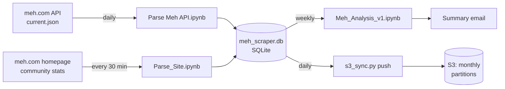
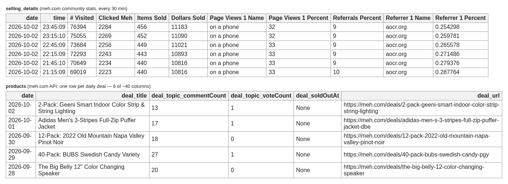
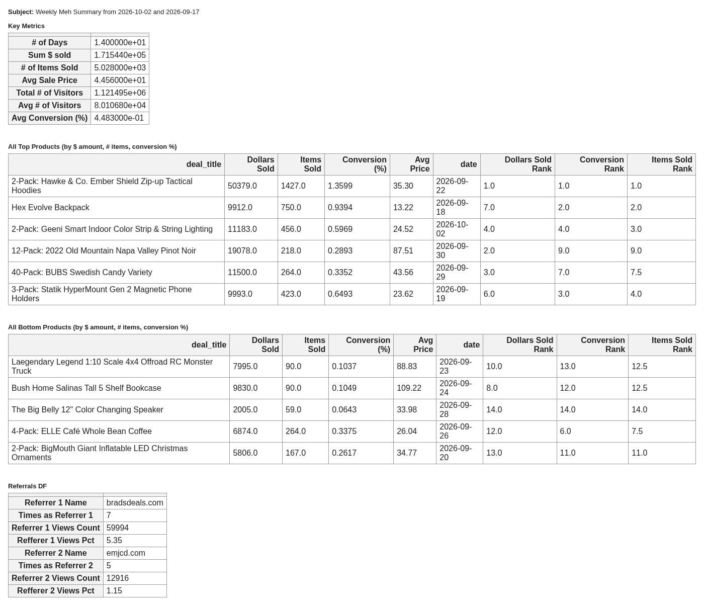
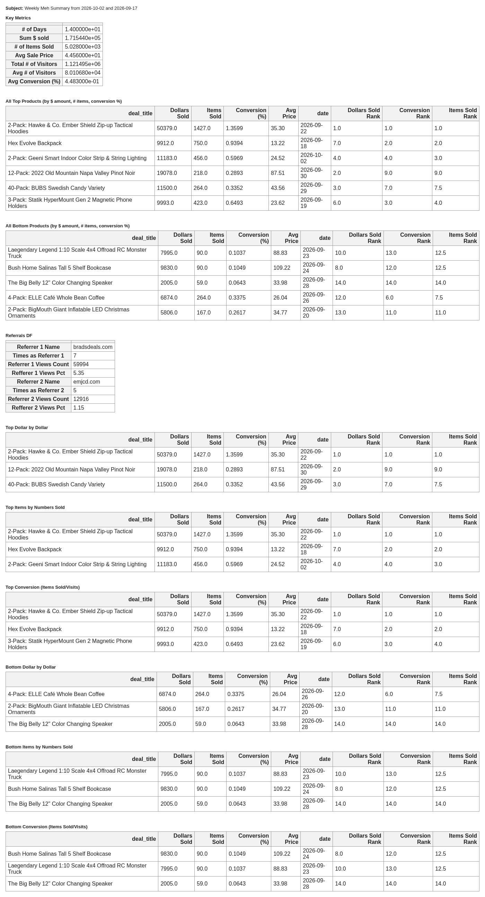

# meh_scraper

Collects daily-deal and sales data from [meh.com](https://meh.com) into a SQLite database and emails a weekly summary of how each deal sold.

meh.com sells one product per day and shows live community stats on its homepage: visitors, items sold, dollars sold and referrers. This project records those stats every 30 minutes and records the deal itself (title, story, specs, comment and vote counts) once a day from the meh.com API. A weekly report then ranks the last two weeks of deals by revenue, units sold and conversion.

## How it works



All logic lives in Jupyter notebooks. The shell scripts in `scripts/` run them headlessly with [papermill](https://papermill.readthedocs.io/), and cron runs the scripts:

| Job | Script | Notebook | Schedule |
| --- | --- | --- | --- |
| Site scrape | `scripts/run_site_scraper.sh` | `notebooks/Parse_Site.ipynb` | Every 30 min (:15, :45) |
| API scrape | `scripts/run_notebook.sh` | `notebooks/Parse Meh API.ipynb` | Daily, 18:45 |
| Weekly report | `scripts/run_weekly_analysis.sh` | `notebooks/Meh_Analysis_v1.ipynb` | Mondays, 20:06 |
| Backup | `scripts/aws_backup.sh` | `scripts/s3_sync.py` | Daily, 07:35 |

Each notebook script saves its executed notebook to `notebooks/run_notebooks/<Name>_<MM-DD-YY>.ipynb`. It deletes that file if the run succeeds, so any notebook left in that folder is a failed run you can open to debug.

## Data collected

The database has four tables. Each has a `date` column (`YYYY-MM-DD`), and the data goes back to February 2020.

| Table | Source | Rows (Oct 2026) | Contents |
| --- | --- | --- | --- |
| `selling_details` | Homepage, every 30 min | ~93k | Parsed community stats: `# Visited`, `Clicked Meh`, `Items Sold`, `Dollars Sold`, page-view device split, `Typed Meh Percent`, `Referrals Percent`, and the top 5 referrers with their share |
| `raw_site_community_stats` | Homepage, every 30 min | ~96k | The raw `community-stats` HTML that `selling_details` is parsed from (most of the DB's ~1.4 GB) |
| `products` | API, daily | ~2k | The day's deal, poll and video, flattened from JSON into ~40 columns: `deal_title`, `deal_url`, `deal_features`, `deal_specifications`, `deal_story_*`, `deal_topic_commentCount` / `voteCount`, `deal_soldOutAt`, `poll_*`, `video_*`, ... |
| `raw_response_backup` | API, daily | ~2k | The full raw API JSON for each day |



The `selling_details` figures are running totals for the current day: `Items Sold`, `Dollars Sold` and `# Visited` climb through the day. The analysis keeps the last snapshot of each day as that day's totals.

When the API starts returning a new field, `Parse Meh API.ipynb` adds it as a new column. To do that it rewrites the whole `products` table, and existing rows get `NULL` in the new column.

## Weekly report

`Meh_Analysis_v1.ipynb` covers about the last two weeks, ending yesterday. It keeps one end-of-day row per date from `selling_details` and joins it to `products` by date. Then it emails the following as HTML tables. The report has no charts.

| Section | What it shows |
| --- | --- |
| Key Metrics | Number of days, total dollars and items sold, average sale price, total and average visitors, overall conversion (items sold / visitors) |
| All Top Products / All Bottom Products | The top 3 and bottom 3 deals by dollars, items and conversion, combined into one table each with duplicates removed |
| Referrals | The most frequent #1 and #2 referrer sites, how many days each held that spot, and their estimated visits and share of visits |
| Top / Bottom by Dollars, Items, Conversion | The same rankings as six separate 3-row tables |

Each deal row includes `Dollars Sold`, `Items Sold`, `Conversion (%)`, `Avg Price` (dollars ÷ items) and its rank on each measure within the period.



<details>
<summary>Full report (all sections)</summary>



</details>

These screenshots come from the report for 2026-09-17 to 2026-10-02. They were rendered from the same notebook code without sending the email.

## Setup

```bash
python3 -m venv meh_scraper_env && source meh_scraper_env/bin/activate
pip install -r scripts/requirements.txt
mkdir -p notebooks/run_notebooks /mnt/volume-nyc3-01/meh_data
sqlite3 /mnt/volume-nyc3-01/meh_data/meh_scraper.db < scripts/create_db.sh
```

`scripts/getting_started.sh` contains these steps. `create_db.sh` is SQL despite its name, and it creates only the two raw tables. `Parse_Site.ipynb` creates `selling_details` the first time it writes. `Parse Meh API.ipynb` reads one row of `products` to compare columns before appending, so `products` must already exist with at least one row. On a new database, seed it once, for example with the backfill notebook. You need a meh.com API key from <https://meh.com/developers-developers-developers>, set as `key1` in `Parse Meh API.ipynb`. The run scripts activate the virtualenv at `/home/malcolm/main`, so change that path if your environment differs.

Example crontab:

```cron
15,45 * * * * bash /path/to/meh_scraper/scripts/run_site_scraper.sh
45 18 * * *   bash /path/to/meh_scraper/scripts/run_notebook.sh
6 20 * * Mon  bash /path/to/meh_scraper/scripts/run_weekly_analysis.sh
35 7 * * *    bash /path/to/meh_scraper/scripts/aws_backup.sh
```

## Running and testing

The production database is `/mnt/volume-nyc3-01/meh_data/meh_scraper.db`. Every script reads `MEH_DB_LOCATION` to use a different database instead, which is useful for testing against a copy:

```bash
MEH_DB_LOCATION=data/meh_scraper_qa.db bash scripts/run_site_scraper.sh
papermill "notebooks/Parse Meh API.ipynb" out.ipynb -p db_location data/meh_scraper_qa.db
```

The weekly report sends email through an `EmailSender` class imported from `/home/malcolm/EmailSender1/`, which is not part of this repo.

## Backups and restoring data

`scripts/aws_backup.sh` runs `scripts/s3_sync.py push`. It stores each table as monthly gzipped SQLite files plus a `manifest.json` in `s3://do-mt-backups/meh_db_incremental/`. The full history is about 53 MB, compared with 1.4 GB for the raw database.

- Each daily push uploads only the months whose data changed, which is normally just the current month.
- A push refuses to overwrite a month in the backup with one that has fewer rows, so a damaged local database can't overwrite good backups. `--force` overrides this.

To get data back as one merged database:

```bash
python scripts/s3_sync.py status                                   # what's in the backup
python scripts/s3_sync.py pull --out data/meh_restored.db          # everything
python scripts/s3_sync.py pull --out data/recent.db \
    --tables products selling_details --since 2026-01              # a subset
MEH_DB_LOCATION=data/recent.db bash scripts/run_weekly_analysis.sh # run the report on it
```

More details are in [docs/database-location.md](docs/database-location.md).

## Other notebooks

- `Run_Analysis_Notebooks.ipynb` and `Generalized Run Notebooks.ipynb` are alternative runners. They execute the weekly report and email you the error if it fails.
- `Backfill Products Table, dedup backup.ipynb` is a one-off that rebuilt `products` from `raw_response_backup`.
- Cells of type `raw` in the notebooks are disabled code (old experiments and QA database copy commands). Papermill skips them.
